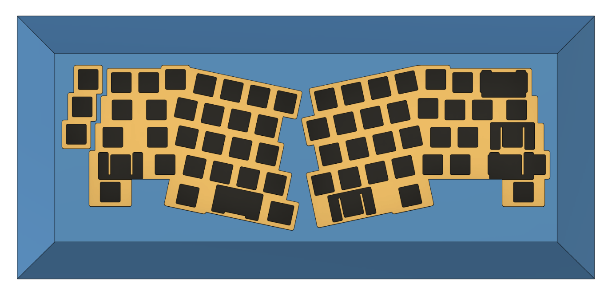
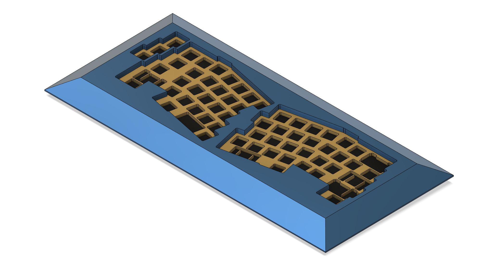
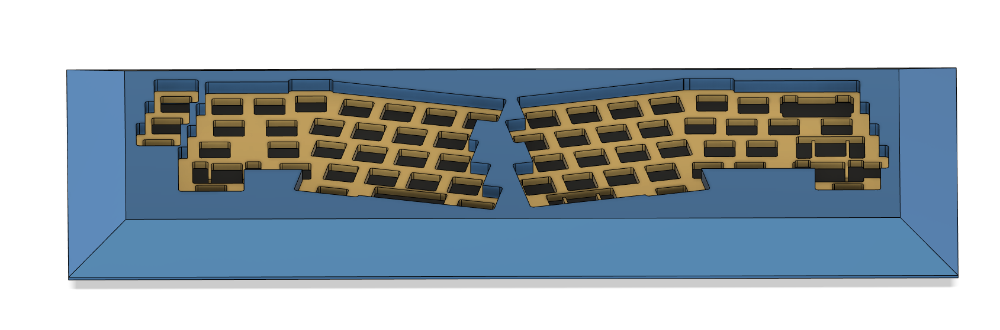
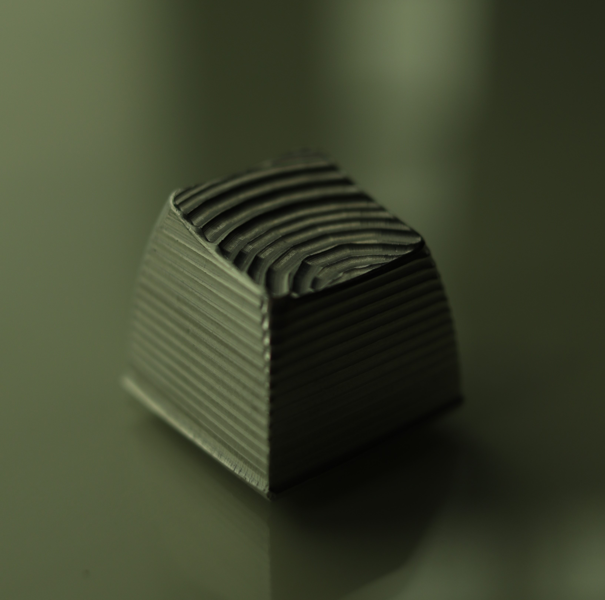
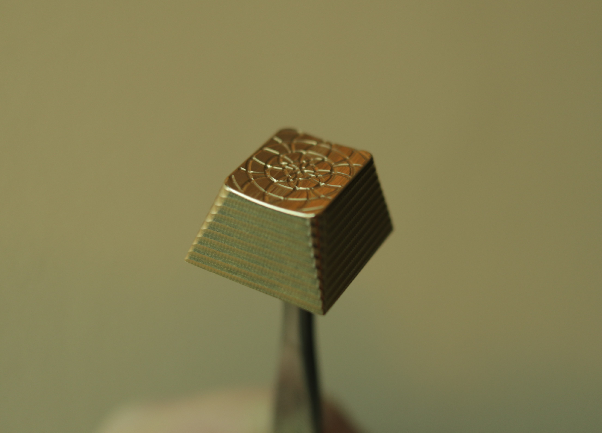
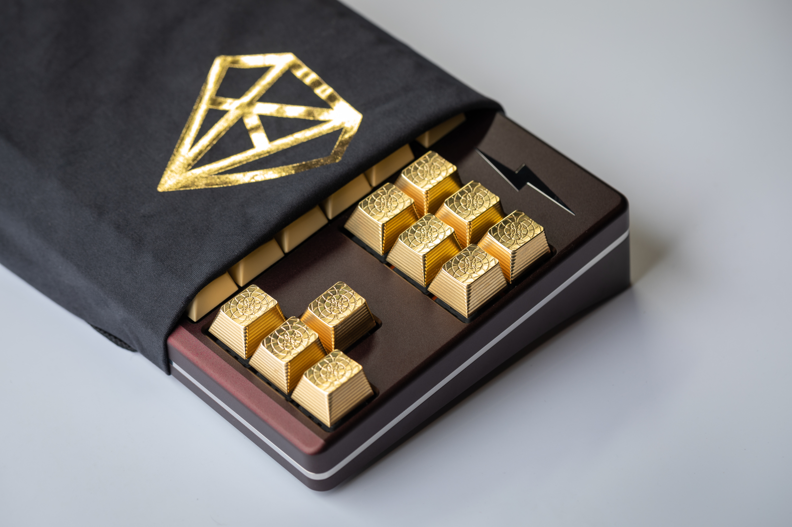
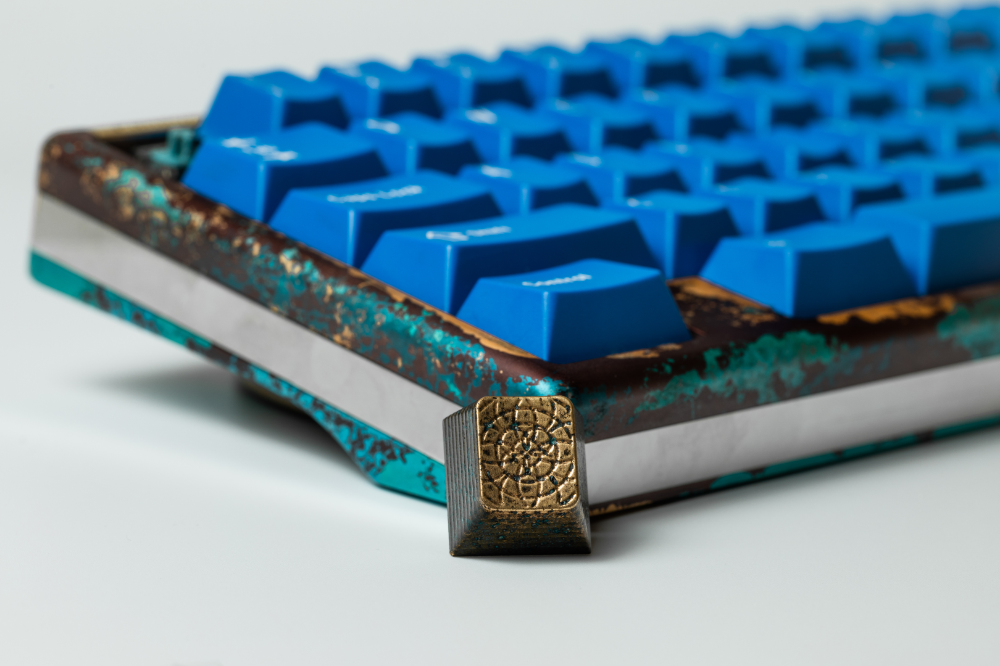
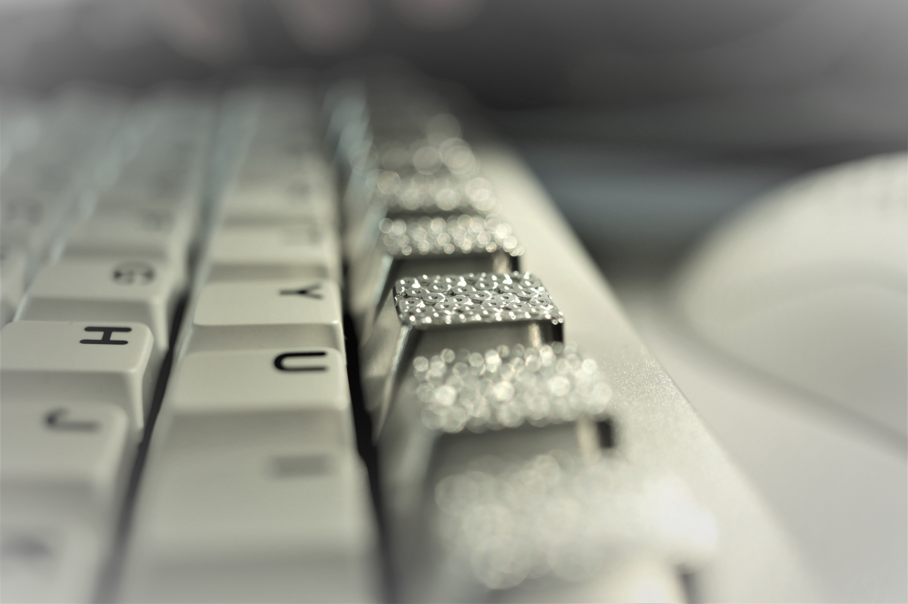

# Keyboard related projects (wzl-keyboards)

## Table of Contents
- [How it started](#How-it-started)
- [Design](#Design)
  - [PCB](#PCB)
  - [Machined](#Machined)
  - [Assembled](#Assembled)
- [Artisan Keycaps](#Artisan-Keycaps)
  - [First Prototype](#My-First-Keycap(SA-Profile))
  - [Brass](#Brass-Keycap(Cherry-Profile))
  - [Aluminium](#Aluminium-Keycap-1)
  - [Brass Meteorite Videos](#Brass-Meteorite-Videos) 
## How it started
During the pandemic weekends got a bit boring, I decided to learn how to draw, design and machine using Fusion360. With access to a Fanuc Robodrill, my machining hobby started off with my first keyboard(named Ellya, following the norm in the Mechanical Keyboard Community), progressing to more complex designs such as the keycaps. I gained experience learning how the different material(aluminium, brass, copper, stainless steel etc) properties affect how the material can be machined and by varying feed rates, spindle speed and tool path, I was able to get some unique looking finishes on my artisan keycaps.

## Design

Top View:

Side View:

Front View:

 

## PCB

## Machined

## Assembled

   

## Artisan Keycaps

## My First Keycap(SA Profile)

   

## My Second Keycap(Cherry Profile)

   

## Brass Keycap(Cherry Profile)

   

## Brass Keycap on Zeus TKL Keyboard

   

## Brass Keycap with Zeus TKL Keyboard in background

   

## Aluminium Keycap 1

   

## Aluminium Keycap 2

   

## Brass Meteorite Videos

